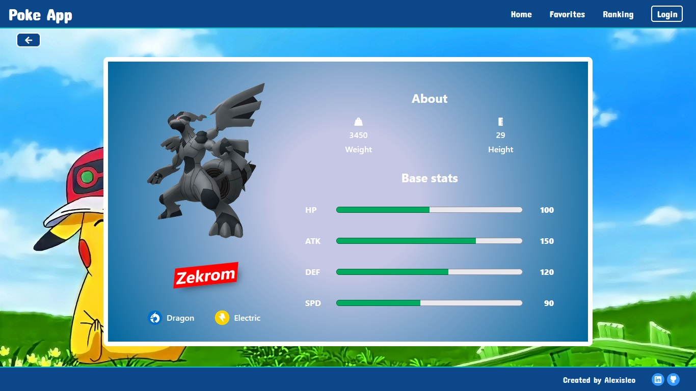

# Poke App

Esta es una aplicación web (SPA) que proporciona mazos de 40 cartas aleatorias de Pokémon, aprovechando herramientas como React, Redux, Express, Sequelize y PostgreSQL para ofrecer una experiencia fluida y amigable.

La idea general fue crear una aplicación en la cual se pueda ver información de distintos Pokémon utilizando la API externa [pokeapi](https://pokeapi.co) y a partir de ella poder, entre otras cosas:

- Guardar cartas de Pokémon favoritos (solo con inicio de sesión).
- Visualizar el ranking de las diez cartas que más usuarios tienen como favoritas.
- Ordenar alfabéticamente o por medidas.
- Filtrar por tipo (eléctrico, agua, fuego, tierra).
- Búsqueda por nombre.
- Paginar.
- Retener datos mediante LocalStorage.

## Frontend

En el desarrollo Frontend de la aplicación, se emplearon tecnologías como React y Redux.

## Capturas de Pantalla

A continuación, te presento algunas capturas de pantalla que te dan una idea visual de las características más destacadas de la aplicación:

**Inicio:**


**Filtros:**


**Búsqueda:**


**Detalles de cada Pokémon:**


**Favoritos (sin iniciar sesión):**


**Favoritos (con sesión iniciada):**


**Ranking:**


### Iniciar la Aplicación desde el Lado del Frontend:

Si deseas ejecutar la aplicación en tu entorno local, sigue estos sencillos pasos:

1. Navega hasta la carpeta principal del cliente:
   ```bash
   cd client
   ```

2. Instala las dependencias de la aplicación utilizando npm:
   ```bash
   npm install
   ```

3. Inicia la aplicación en modo de desarrollo:
   ```bash
   npm start
   ```

4. Abre tu navegador web y visita http://localhost:3000 para explorar la aplicación.

## Backend

La sección de backend de la aplicación está basada en tecnologías como Node y Express, y se implementan las siguientes rutas esenciales:

- [ ] __GET /pokemons__:
  - Retorna 40 Pokémon al azar o que coincidan con un nombre pasado por query params.
- [ ] __GET /pokemons/:id__:
  - Retorna un Pokémon por su id.

- [ ] __GET /favorite/ranking__:
  - Retorna el ranking de los 10 Pokémon con más estrellas.
- [ ] __GET /favorite/:email__:
  - Retorna los Pokémon favoritos de un usuario por su correo electrónico.
- [ ] __POST /favorite__:
  - Crea (o agrega una estrella) un Pokémon relacionándolo con el usuario.
- [ ] __DELETE /favorite/:id/:email__:
  - Quita una estrella a un Pokémon relacionado con el usuario por su correo electrónico.

- [ ] __GET /user__:
  - Retorna todos los usuarios.
- [ ] __POST /user/:email__:
  - Crea un usuario por su correo electrónico.

- [ ] __GET /type__:
  - Retorna todos los tipos de Pokémon.

### Iniciar la Aplicación desde el Lado del Backend:

Si tienes curiosidad y quieres probar la aplicación en tu propio entorno, sigue estos pasos:

1. Dirígete a la carpeta principal del servidor:
   ```bash
   cd api
   ```

2. Instala las dependencias de la aplicación utilizando npm:
   ```bash
   npm install
   ```

3. Renombra el archivo `.env.template` a `.env` y reemplaza los valores de las variables correspondientes.

4. Inicia la aplicación en modo de desarrollo:
   ```bash
   npm start
   ```

5. Abre tu navegador web y visita http://localhost:PUERTO para explorar la aplicación.

## Otras Capturas:




